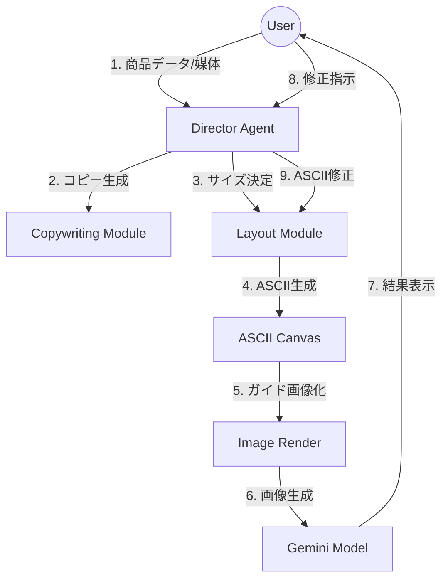

# Smart Banner Generator (v2.0) 実装計画

## プロジェクトの目的
商品データに基づき、各SNS（Instagram, TikTok, X）に最適化された広告バナーを生成するCLIツールを構築します。中間表現としてのレイアウトに「ASCIIアート」を使用することで、LLMによる低コストかつ高精度なフィードバック修正と再生成を実現します。

## アーキテクチャ概要
Director Agentが全体を指揮するパイプラインアーキテクチャを採用します。



## 技術スタック
- **ランタイム**: Node.js (v20+)
- **言語**: TypeScript
- **CLIフレームワーク**: `commander` または `@inquirer/prompts`（対話型フィードバック用）
- **画像処理**: `canvas` (node-canvas) - ASCIIからガイド画像へのレンダリング用
- **AIモデル**: Google Generative AI SDK (`@google/generative-ai`)
  - **Gemini 1.5 Pro**: レイアウトロジック、コピー生成用
  - **Gemini Nano / Pro Vision / Imagen**: 最終的な画像生成用（テキスト描画精度重視）
- **ユーティリティ**: `zod` (バリデーション), `chalk` (CLI装飾)

## モジュール仕様

### 1. プロジェクト構造
```text
src/
├── bin/              # CLIエントリーポイント
├── config/           # プラットフォーム定義 (Insta, TikTok, X)
├── core/
│   ├── director.ts   # メインオーケストレーション
│   ├── layout.ts     # ASCIIグリッドロジック
│   ├── ascii.ts      # ASCII操作
│   ├── visualizer.ts # Canvasレンダリング
│   ├── llm.ts        # Gemini APIラッパー（テキスト生成・レイアウト）
│   └── prompt_engineer.ts # 画像生成プロンプト最適化
├── types/            # 共通インターフェース
└── utils/            # ヘルパー関数
```

### 2. コアモジュール詳細

#### A. Director Agent (`core/director.ts`)
- **役割**: コーディネーター。ユーザー入力を受け取り、フィードバックループの状態を管理します。
- **ロジック**:
  - **フェーズ1: インタビュー (対話)**:
    - 詳細要件が不足している場合、以下をヒアリングします：
      1. ターゲット媒体/目的（Instagramフィード、楽天商品画像、LPパーツなど）
      2. 現在のブランド/雰囲気（またはWebサイトURL）
      3. 具体的なデザイン目標（認知拡大、特定商品の売上、サブスク獲得など）
  - **フェーズ2: レイアウト生成 (Gemini)**:
    - `LayoutEngine` を呼び出し、「Pro EC Marketer」システムプロンプトを用いて生成します。
    - **制約**: リクエストは1つずつ処理します。複数バリエーションが必要な場合も「1つ生成→確認→次を生成」のフローを順守します。
  - **フェーズ3: フィードバックループ**:
    - ASCIIレイアウトと生成されたプロンプトの説明を表示します。
    - ユーザーに「このデザイン戦略で進めて良いか？」を確認します。
    - Yes → 画像生成へ進む。
    - No → 自然言語での修正指示を受け付け、レイアウト生成へ戻る（再帰）。

#### B. Layout & ASCII Engine (`core/layout.ts`, `core/ascii.ts`)
- **役割**: ASCIIグリッドの管理と表現。「Pro EC Marketer」ペルソナに基づき動作します。
- **システムプロンプト戦略**:
  - **ペルソナ**: プロECマーケッター / 日本トップ1%のWebデザイナー。
  - **思考プロセス**: コンバージョン率（CVR）最大化を最優先。視線誘導（Z型、F型など）を考慮。
  - **出力**: ASCIIアートに加え、以下の注釈を含めます：
    - フォントのウェイト/色/配置
    - 画像の構図（全体配置、分割など）
    - 「ダイナミックフロー」（視線の流れ）の解説
  - **厳格な出力形式**: 1回のレスポンスにつき1つのデザイン案のみ。
- **機能**:
  - **動的アスペクト比**:
    - `SQUARE` (1:1), `PORTRAIT` (9:16), `LANDSCAPE` (1.91:1)
  - **パース機能**: LLMのレスポンスからASCIIブロックと画像生成用プロンプト情報を抽出するロジック。

#### C. Visualizer (`core/visualizer.ts`)
- **役割**: 注釈付きASCIIを、ユーザー確認用の「ドラフト画像（ガイド画像）」に変換します。
- **実装**:
  - `node-canvas` を使用。
  - ASCIIグリッドを解析し、特定のトークン（`[CTA]`, `[HERO_IMG]`など）を色付きブロックやプレースホルダーとして描画します。
  - 最終的な生成AIへのガイドとして機能するラフ画像を生成します。

#### D. GenAI / Image Production (`core/llm.ts` & `core/prompt_engineer.ts`)
- **役割**:
  1. **プロンプトエンジニアリング (The Transformer)**:
     - 入力: ASCIIレイアウト + 文脈 + コピー
     - 役割: **熟練AI画像プロンプトエンジニア** (Adobe Firefly / Midjourney 専門)
     - **ロジック**:
       - **分析**: 「描画すべきテキスト」と「視覚的要素（バッジ、ボタンなど）」を厳密に分離します。
       - **哲学**: "100/100 Quality"。抽象的な「高級感」を、物理的な素材（「マットなカードストック」「金箔押し」など）へ翻訳します。
       - **出力**: 指定された厳格な英語フォーマット。
         - `[Overall Concept]`
         - `**Atmosphere & Vibe**`
         - `**Materials & Colors**`
         - `**Elements**` (UIコンポーネントの物理的描写)
         - `**Text Rendering**` (純粋なテキスト文字列のみ。メタデータ不可)
         - `**Technical Specs**` (カメラ、アスペクト比)
  2. **画像生成**: 「ガイド画像」+「厳格な英語プロンプト」を画像生成モデルに送信します。

## 開発フェーズ

### フェーズ1: 基盤構築と「The Marketer」の実装
1.  TypeScript (`npm`) プロジェクトのセットアップ。
2.  CLI「インタビューモード」の実装 (`@inquirer/prompts` 使用)。
3.  `core/llm.ts` に **「Pro EC Marketer」システムプロンプト** を実装。
4.  LLMがペルソナ通りに振る舞い、適切な質問やASCII生成を行うか検証。

### フェーズ2: 順次処理ワークフローの実装
1.  ループ処理の実装: `インタビュー` -> `レイアウト(ASCII)` -> `ユーザーレビュー` -> `修正/次へ`。
2.  「1つずつ処理」するロジックの厳格な適用。

### フェーズ3: 視覚化と創造
1.  マーケッターが作成したデザイン案をレンダリングする `ASCIICanvas` の実装。
2.  **「Expert Image Prompt Engineer」** ロジックの実装と、画像生成APIとの統合。

### フェーズ4: プロダクション化と品質向上
1.  各プラットフォーム向けのプロンプト微調整。
2.  エラーハンドリング（LLMがASCII形式を崩した場合のリトライ処理など）。

## 検証計画
### 自動テスト
- `ASCIICanvas` の単体テスト: グリッドのリサイズ、要素の衝突検知が正しく動作すること。
- 統合テスト: `ASCII` -> `Visualizer` -> `PNGファイル生成` のパイプライン確認。

### 手動検証
- CLI実行: `npm start` でインタビューモードを開始。
- マーケッターペルソナの挙動確認（適切なヒアリングが行われるか）。
- プロンプトエンジニアの出力確認（「高級感」が具体的な物理描写に変換されているか）。
- 最終画像生成: 生成された画像がASCIIのレイアウト指示に従っているか確認。
